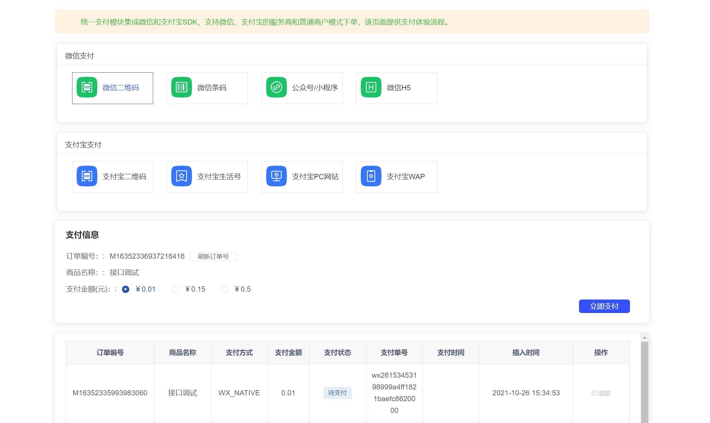
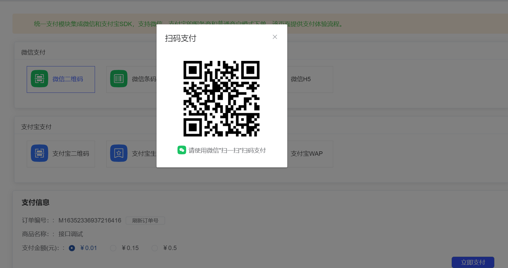

## 统一支付模块简介

统一支付模块集成微信支付，支付宝支付。

* 目前集成微信支付得扫码支付，提供 微信支付统一下单接口、订单支付异步通知接口、退款接口。
* 使用之前需要配置好所需配置（zc-payment/src/main/resources/application.properties）。
* Demo案例请看注解地址（/payment/wxPay），前端地址（src/views/payment/example/index.vue）

## 在线文档
微信支付API地址：https://pay.weixin.qq.com/wiki/doc/api/native.php?chapter=9_1  

## 演示图

